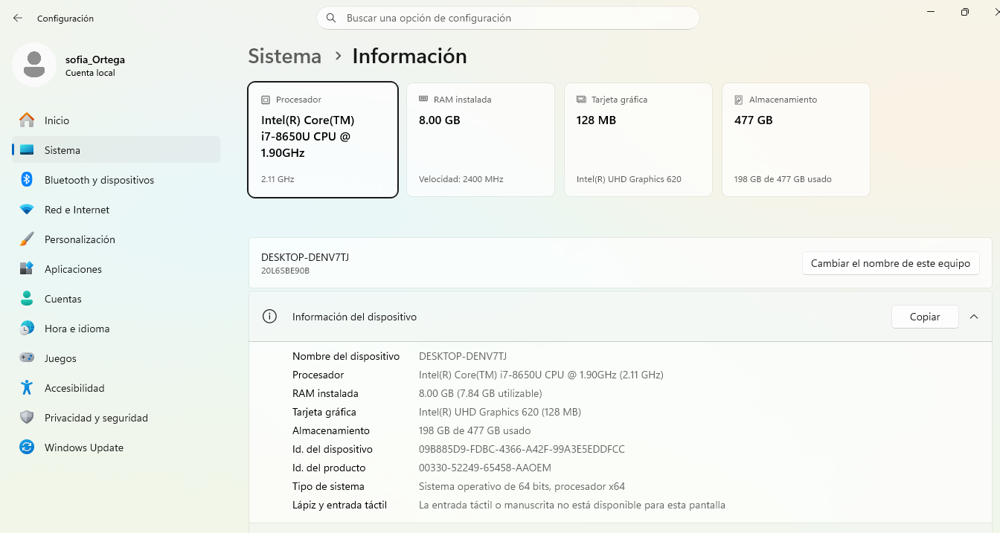

# Práctica 3: Aplicaciones Nativas

**Instituto Politécnico Nacional - Escuela Superior de Cómputo**  
**Materia:** Desarrollo de aplicaciones móviles nativas  
**Profesor:** Grabiel Hurtado Avilés  
**Fecha:** 28/09/26  

## Integrantes del Equipo
* Diego Mendieta González - [2024630077]
* Sofía Ortega García - [2024630517]

---

## Ejercicio 1: Instalación de iOS/macOS en la Mejor PC del Equipo

### 1.1 Identificación y Comparativa de Equipos

Para cumplir con los requisitos de la práctica, se analizaron las especificaciones de las computadoras de los integrantes del equipo para determinar cuál cuenta con el mejor rendimiento (procesador, memoria RAM y capacidad de virtualización) para albergar el entorno de desarrollo macOS mediante Docker.

| Integrante | Procesador (CPU) | Memoria (RAM) | Almacenamiento | Tarjeta Gráfica (GPU) | Justificación / Estado |
| :--- | :--- | :--- | :--- | :--- | :--- |
| **Diego Mendieta** | AMD Ryzen 5 7520U @ 2.80GHz | 8 GB | SSD (NVMe) | AMD Radeon Graphics (Integrada) | |
| **Sofía Ortega** | Intel (Lenovo ThinkPad T480) | 8 GB (7.84 GB usables) | SSD 477 GB (198 GB usados) | Intel UHD Graphics | **No Seleccionada:** No cuenta con suficiente memoria RAM libre ni el mejor rendimiento. |

* **Equipo Seleccionado:** (Pendiente).
* **Responsable del Entorno:**(Pendiete)

#### Evidencia de Hardware

---

### 1.2 Bitácora de Sesiones de Trabajo

A pesar de que el entorno se instala en una sola computadora, todo el equipo participó de forma colaborativa en el análisis, configuración y pruebas:

* **Fecha de sesión:** 
* **Horario:** 16:00 - 19:00
* **Modalidad:** Presencial
* **Integrantes presentes:** Diego Mendieta González y Sofía Ortega García
* **Actividades realizadas:** Comparativa de equipos, clonación del repositorio de Docker

---

### 1.3 Instalación del Entorno macOS con Docker

1. Se clonó el repositorio oficial de la práctica: `github.com/gabrielhuav/MacOS-Docker`.
2. Se validaron los requisitos del sistema para virtualización.
3. Se configuraron los recursos óptimos en el contenedor
4. Se verificó el arranque exitoso de macOS y la conectividad a internet dentro del contenedor.

---

### 1.4 Configuración del Entorno de Desarrollo iOS

---

## Ejercicio 2: Gestor de Archivos para iPhone (desarrollado desde macOS)
* **Descripción:** 
* **Requisitos previos:** 
* **Instrucciones de compilación y ejecución:** 
* **Uso:** 

---

## Ejercicio 3: Aplicación de Cámara y Micrófono para iPhone (desarrollada desde macOS)
* **Descripción:** 
* **Requisitos previos:**
* **Instrucciones de compilación y ejecución:** 
* **Uso:**

---

## Ejercicio 4: Desarrollo Multiplataforma con Flutter
* **Opción Elegida:**
* **Descripción:**
* **Instrucciones de instalación:** 
  * Para Android 
  * Para iOS 
* **Uso:**

---

## Ejercicio 5: Desarrollo Multiplataforma con Kotlin Multiplatform
* **Opción Elegida:** 
* **Descripción:** 
* **Instrucciones de instalación:** 
  * Para Android 
  * Para iOS 
* **Uso:**